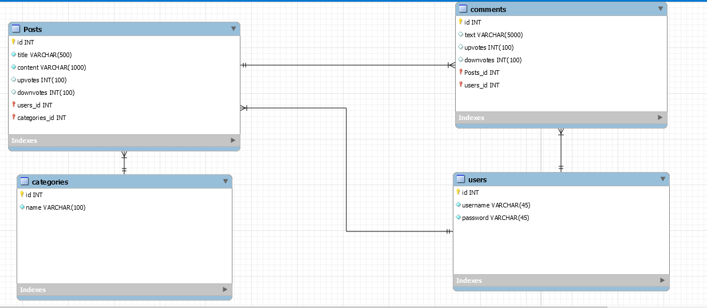

# Team Snowstorm
## Our Team:
* Hayden VonCannon
* Marvie Solis
* Jason Hong
* Eddie Borja
* Jonathan Mai

## Post.it Project

### Technology Used:
* NodeJS
* Sequelize
* Handlebars
* Express
* PassPortJS
* bcrypt
* Bootstrap
* Heroku
* JawsDB

### Project Description:
This project will allow user login and users will be able to create posts and assign it a specific category.
When you create a post, it will show up on the landing page of the website. Along with the landing page, we will have category pages that will list only the posts associated with the category. If you click into an author, it will show posts and comments made by the author. On each post, users can comment on the post and also upvote comments and posts per user.

### Database Visualization

### Breakdown of Tasks for MVP
#### Front End
* Landing page layout
    * List View
        * Display title, preview text, author, votes(up and down), category
        * Get Method to grab all posts
* Navbar
    * Logo
    * Add new post button on top
    * Dropdown of all categories
        * Get method for all categories
* Template Pages
    * Author Creation
        * Create a text field and submit button for author
    * Category Creation
        * Create a text field and submit button for category
* Post Creation
    * Text field for text
    * Author dropdown
    * Category dropdown
    * Submit button for text
* Post
    * Display title, full text, author, votes(up and down), category
    * Text field and button for submitting comments
#### Back End
* Create visualization of db schema
* Create Database
    * Post Table
    * Comment Table
    * Author Table
    * Category Table
* Create a get route for posts, comments, authors, categories
* Create a post route posts, comments, authors, categories
* Create a put for voting and editing full text on posts
* Create a delete method for deleting posts

### Future Plans
* Search functionality
* Threaded comments chains
* Voting on comments
* Password Resets
* Scraping linked sites for content
* Editing comments and posts

### How To Check Out Branches and Push Code
1. Navigate to our Project Board and find your issue #
2. Go back to terminal and run a 'git checkout -b PostIt-issueNumGoesHere-quick-description'
    * Example: 'git checkout -b PostIt-19-update-readme'
    * 
3. Make your changes
4. When you're ready to commit follow these steps:
    1. Run 'git add .' to add all your changes
    2. Run 'git commit -m "#issueNumber with description of what you did afterwards"'
        * This step is important, if you dont add your issue number then github won't recognize the commit and display the commit message on github
    3. Push your changes 'git push origin branchName'
    * 
5. If you have any questions or are skeptical about something, ask Jonathan :D
